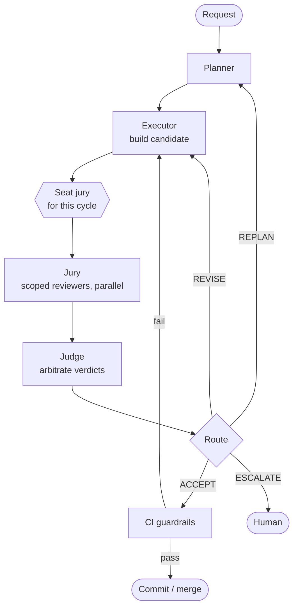

# Judge, Jury, Executioner

A generator–critic loop with a panel of scoped reviewers and a meta-controller that routes the next step. Beyond the work itself there are four moving parts: something proposes a plan, something builds against it, a set of specialists reviews the result, and a controller decides whether to ship, revise, replan, or escalate. This document specifies that loop as a set of Claude Code subagents, the tools each one gets, and how a user seats the reviewers they want for a given run.

A note on the name, which inverts the legal metaphor slightly. The executioner here runs second, not last; it produces the candidate before the jury sees anything. The thing that actually carries out the sentence is the final commit of an approved change. The role names below (Planner, Executor, Jury, Judge) keep the mechanics precise, and the branding can stay.

## The model

Four roles, one loop, one invariant.

The invariant: the loop operates on a *candidate*, never on the mainline. The Executor writes to a scratch branch or an uncommitted working tree. Nothing reaches `main` until the Judge returns ACCEPT and CI passes. This is what makes the loop safe to run unattended. A bad iteration costs a re-run, not a revert.

The four roles:

- **Planner** turns a request into a structured plan: the steps, the files in scope, the risks, and the success criteria the result will be checked against.
- **Executor** builds the candidate against the plan and reports what it did.
- **Jury** is a set of independent, scoped reviewers. Each one looks at the candidate through a single lens and emits a structured verdict. They run in parallel and never see each other's output.
- **Judge** reads the verdicts and returns one routing decision. It does not review the candidate itself; it reasons over what the jury found.

The loop runs Planner → Executor → Jury → Judge, and the Judge's decision sends control back to the Executor (revise), back to the Planner (replan), forward to commit (accept), or out to a human (escalate).

## Control flow



Two counters guard the loop. An *iteration budget* caps total trips through Executor → Judge; a CI failure that bounces back to the Executor counts against it. An *oscillation guard* tracks finding identities across iterations: if the same blocking finding reappears, or two findings contradict each other (reviewer A demands X, fixing X trips reviewer B), the Judge escalates rather than looping. Without both, the loop can run away in cost or thrash forever on an irreconcilable pair of demands.

The user enters the loop at one point: seating the jury, at the start of each cycle.

## The roles

### Planner

Reads the request and the relevant code, produces a plan, stops. It does not edit anything.

- **Tools:** `Read`, `Grep`, `Glob`, plus `WebSearch` if the task needs external research.
- **Output:** a plan object — ordered steps, files in scope, risk notes, and explicit success criteria. The success criteria carry weight: they are what the jury checks against, so vague criteria produce vague reviews.

The Planner stays live for the whole loop, because REPLAN routes back to it. Treat it as a callable role, not a one-shot opening step.

### Executor

Builds the candidate against the plan.

- **Tools:** `Read`, `Write`, `Edit`, `Bash`, `Grep`, `Glob`.
- **Output:** the candidate diff plus a short self-report — what it changed, which plan steps it covered, and anything it couldn't do. The self-report gives the jury a map; it does not replace review.

On REVISE, the Executor receives the Judge's scoped feedback (the specific blocking findings) and fixes only those. It does not re-architect on a revise.

### Jury

A set of reviewers, each scoped to one concern. Three properties make the jury work:

- **Independent.** No juror reads another's verdict. This keeps them unbiased and lets them run in parallel.
- **Scoped.** A juror comments only inside its lane. The security juror says nothing about performance; the cost juror says nothing about naming. Scope is what keeps the verdict bundle signal-dense instead of five overlapping opinions.
- **Tool-backed where possible.** A reviewer that runs Semgrep beats one that reasons about security from the diff. A reviewer that runs the test suite beats one eyeballing complexity. Reserve pure model judgment for genuinely subjective calls and back everything else with an executable check, citing its output as evidence. This is the single biggest lever on review quality, since the ceiling of the whole system is how good the reviews are.

The user picks which jurors are seated for a given cycle. The roster follows below.

### Judge

Arbitrates and routes. It is the only role with a bounded action set, and that boundary is what gives the loop defined semantics.

- **Tools:** `Read` only. The Judge reasons over verdicts; it does not run checks or edit code.
- **Action set:** `ACCEPT`, `REVISE`, `REPLAN`, `ESCALATE`.
- **Output:** the decision, a rationale, scoped feedback for the Executor or Planner, and the list of unresolved finding IDs.

Routing logic is specified below.

## The juror roster

The menu a user picks from. Each juror is a subagent with tools matched to its lane and a SKILL file holding its checklist and exact commands. The "blocks on" column is the bar for a *blocking* finding; anything below it is advisory, and the Judge weighs it but does not gate on it.

### Code

| Juror | Lens | Tools / checks | Blocks on |
|---|---|---|---|
| Correctness & Algorithms | Logic, edge cases, complexity | Test runner (`pytest` / `go test` / `cargo test`), complexity reasoning | Failing tests, wrong output, unbounded complexity on a hot path |
| Security | Injection, secrets, authz, deps | `gitleaks`, `semgrep`, `gosec` / `bandit`, dependency audit (`govulncheck` / `pip-audit` / `cargo audit`) | Committed secret, injection, known CVE, missing authz check |
| Structure & Conventions | Naming, boundaries, repo standards | Linter (`ruff` / `golangci-lint` / `clippy`), repo conventions file | Violations that break the build or an agreed standard |
| Observability | Logging, metrics, tracing, error paths | Pattern checks over changed files | New surface with no error handling or no instrumentation |
| Interface Compatibility | Public API / signature stability | Signature diff against the published surface | Breaking change to a published interface with no version bump |

### Data pipelines

| Juror | Lens | Tools / checks | Blocks on |
|---|---|---|---|
| Data Contract & Schema | Schema evolution, event contracts | `dbt parse` / `dbt compile`, schema inspection, payload diff | Backwards-incompatible change with live downstream consumers |
| Idempotency & Merge | Write semantics, dedup, watermarks | Reasoning over write path, MERGE keys, retry behavior | Non-idempotent write, duplicate risk, wrong MERGE predicate |
| Cost & Performance | Scans, partitioning, file sizing | Query `EXPLAIN`, partition / clustering checks | Full scan on a large table, unbounded fan-out, runaway warehouse sizing |
| Data Quality | Nulls, dedup, referential integrity | `dbt test`, Great Expectations, constraint checks | Failing data test, a dropped quality constraint |
| Governance & Lineage | Ownership, PII, catalog registration | Tag / owner checks, PII scan, catalog lookup | Untagged PII, a governed-tier change with no named owner |

The roster is meant to be extended. A new lane is a new subagent file plus a SKILL file; nothing else in the loop changes.

## Seating the jury

At the start of each cycle the orchestrator presents the roster and the user selects which jurors to seat. Selection is per cycle, not global, so a small change can run a light jury and a risky one can run the full panel.

Presets cover the common cases; `custom` picks any subset:

- `quick` — Correctness + Security
- `code-full` — all code jurors
- `pipeline` — Data Contract + Idempotency + Data Quality + Cost
- `security-sweep` — Security + Governance + Data Contract
- `full` — every juror (use when promoting something to a guaranteed tier)
- `custom` — choose individually

Re-seating policy:

- **REVISE keeps the seated jury.** The fix is judged against the same critics that flagged it, so you can watch the finding clear.
- **REPLAN re-prompts.** A new plan can change the shape of the work, so the user re-picks.

## The verdict contract

Every juror emits exactly one object in this shape and nothing else. Prose verdicts turn aggregation to mush; structured verdicts let the Judge gate deterministically.

```json
{
  "juror": "security-juror",
  "category": "security",
  "findings": [
    {
      "id": "sec-001",
      "severity": "error",
      "blocking": true,
      "issue": "User input concatenated into SQL in handler.go:142",
      "evidence": "semgrep go.lang.security.audit.sqli @ handler.go:142",
      "suggested_fix": "Parameterize via sqlx.NamedExec"
    }
  ],
  "ran": ["gitleaks", "semgrep", "govulncheck"],
  "skipped": []
}
```

Field notes:

- `severity` is `info | warn | error`. `blocking` is a separate boolean so the Judge can gate without interpreting severity semantics.
- `evidence` is required for any tool-backed finding: the rule ID, the failing test name, the line. A finding with no evidence is treated as advisory.
- `ran` and `skipped` tell the Judge whether the juror actually did its job. A juror that skipped its core check has not really reviewed, and the Judge can weigh that or escalate.

## The judge's routing logic

Evaluated in order, first match wins:

1. Any unresolved `blocking` finding that is **fixable within the current plan** → **REVISE**, passing those findings as the Executor's feedback.
2. Blocking findings that show the **plan's approach is wrong** (the change cannot be made correct without a different approach) → **REPLAN**.
3. No blocking findings → **ACCEPT**.
4. A blocking finding seen in a prior iteration, or two blocking findings that contradict each other, or the iteration budget exhausted → **ESCALATE**.

The REVISE / REPLAN boundary is the judgment call worth tuning. A useful heuristic: if every blocking finding points at a *defect in the work* (a missing check, a bug, a wrong predicate), it is REVISE. If a finding points at the *plan itself* (this is the wrong pattern, this approach cannot satisfy the contract), it is REPLAN. When unsure, prefer REVISE once, then REPLAN if the same class of finding survives the fix. That bounds wasted replans.

## Safety and termination

The loop needs guaranteed termination or it has no defined behavior at the edge.

- **Iteration budget.** A hard cap on Executor → Judge trips. CI failures that bounce back count against it.
- **Oscillation guard.** Track finding IDs across iterations. A recurring blocking finding or a contradictory pair triggers escalation rather than another loop.
- **Escalation is a real exit.** When the loop hits the cap without converging, it stops and hands the human the candidate plus the open findings. Shipping best-effort with findings attached as caveats is a valid alternative policy, but pick one explicitly.
- **CI is the final gate, not a juror.** The jury reviews; CI enforces. ACCEPT promotes the candidate into CI, and only a green run commits. A CI guardrail that blocks destructive changes sits here, after the Judge, as the last line.

## File layout

Claude Code subagents live as markdown files with frontmatter. A workable layout:

```
.claude/
  agents/
    planner.md
    executor.md
    judge.md
    jurors/
      correctness-juror.md
      security-juror.md
      structure-juror.md
      observability-juror.md
      data-contract-juror.md
      idempotency-juror.md
      cost-juror.md
      data-quality-juror.md
      governance-juror.md
skills/
  jje/SKILL.md                  # the verdict contract + loop rules
  security-review/SKILL.md      # exact commands + what the juror flags
  data-contract-review/SKILL.md
  ...
```

Keep the subagents thin and put the domain knowledge in the SKILL files. The juror's system prompt says "review for X only, run the checks in `skills/X/SKILL.md`, emit one verdict"; the SKILL file holds the actual commands and the bar for blocking. A reviewer's logic is then editable in one place while the subagent definition stays stable.

Three concrete definitions to pattern-match the rest:

```yaml
---
name: security-juror
description: Security reviewer for the jury. Audits a candidate for injection, secrets, authz gaps, and unsafe dependencies. Emits one verdict.
tools: Read, Grep, Glob, Bash
model: haiku
---
Review the candidate for security defects only. Say nothing about style,
performance, or correctness outside the security surface.

Run the checks in skills/security-review/SKILL.md against the changed files:
gitleaks on the diff, semgrep with the org ruleset, gosec or bandit by
language, and a dependency audit. Cite tool output as evidence for every
finding. If a check can't run, report it as info-level rather than guessing.

Emit one JSON verdict matching skills/jje/SKILL.md. No prose outside the JSON.
```

```yaml
---
name: data-contract-juror
description: Schema and contract reviewer. Checks event contracts, schema evolution, and downstream dbt/warehouse compatibility for breaking changes.
tools: Read, Grep, Glob, Bash
model: sonnet
---
Review pipeline changes for contract and schema compatibility only.

Per skills/data-contract-review/SKILL.md: check whether a schema change is
additive or drops/retypes a column downstream readers depend on; whether an
event payload changes without a version bump; run dbt parse and dbt compile
and flag models whose contracts break; identify consumers of changed columns.

A backwards-incompatible change with live consumers is blocking. Cite the
column and the consumer as evidence.

Emit one JSON verdict per skills/jje/SKILL.md. No prose outside the JSON.
```

```yaml
---
name: judge
description: Meta-controller. Reads all jury verdicts and returns one routing decision. Does not review the candidate itself.
tools: Read
model: opus
---
Arbitrate the jury's verdicts and return one routing decision. Do not
re-review the candidate; reason over the verdicts.

Rules, first match wins:
1. Any blocking finding fixable within the current plan -> REVISE, with those
   findings as the executor's feedback.
2. Blocking findings showing the plan's approach is wrong -> REPLAN.
3. No blocking findings -> ACCEPT.
4. A blocking finding seen before, a contradictory pair, or the iteration
   budget exhausted -> ESCALATE.

Return JSON: {decision, rationale, feedback, unresolved}. No prose outside it.
```

## Model assignments

The loop multiplies cost by (jurors + Judge + Executor) × iterations, so match model to role.

| Role | Model | Why |
|---|---|---|
| Planner | Sonnet | Bounded reasoning over the request |
| Executor | Sonnet / Opus | Does the actual work, the hard part |
| Most jurors | Haiku | Scoped and tool-backed, cheap to run |
| High-judgment jurors | Sonnet | Contract and architecture calls need more headroom |
| Judge | Opus | Arbitration is the highest-stakes reasoning in the loop |

Tool-backed jurors lean on Haiku because the model is mostly formatting tool output into a verdict, not reasoning from scratch. The Judge gets the strongest model because a wrong route — accepting a broken candidate, or looping on a non-issue — is the most expensive mistake the system can make.

## A run, end to end

A column gets added to a bronze table that a downstream model reads. The request: "add `event_source` to the bronze writer and surface it in the silver model."

1. **Planner** produces: add the field to the writer (nullable, backfill later), update the silver model to select it, success criteria = downstream contracts intact and tests green.
2. **Executor** edits the writer and the silver model, reports both changes.
3. **Seated jury** (`pipeline` preset): data-contract, idempotency, data-quality, cost.
4. **Verdicts:** idempotency clean; cost clean; data-quality warns that the new column is all-null until backfill (advisory, not blocking); data-contract finds that the silver model selects `*` and a downstream gold model has a strict contract that will now break on the extra column — `blocking: true`, evidence = the gold model's contract test.
5. **Judge:** one blocking finding, fixable in-plan → **REVISE**, feedback = pin the silver select list and bump the gold contract.
6. **Executor** applies the fix. Same jury re-runs. data-contract now clean.
7. **Judge:** no blocking findings → **ACCEPT**.
8. **CI** runs `dbt build` and the test suite, passes, commits.

Two iterations, one real defect caught before it reached anything downstream, and the advisory null-column note rode along as a caveat rather than a blocker. That is the loop behaving correctly: gate hard on the contract break, stay quiet on the things that do not matter yet.
